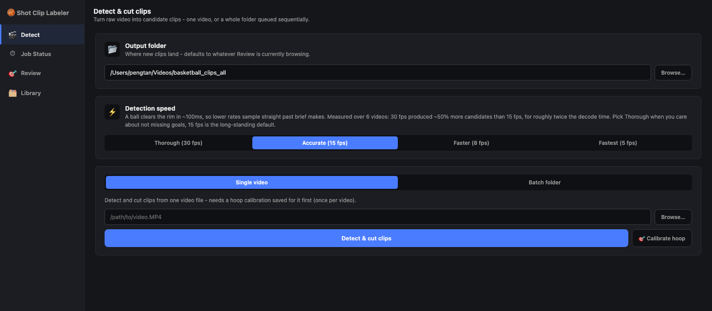
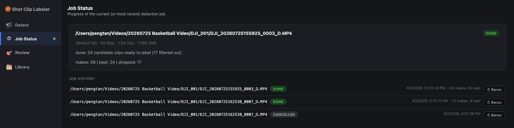
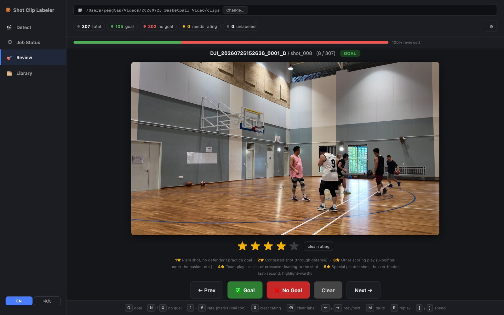
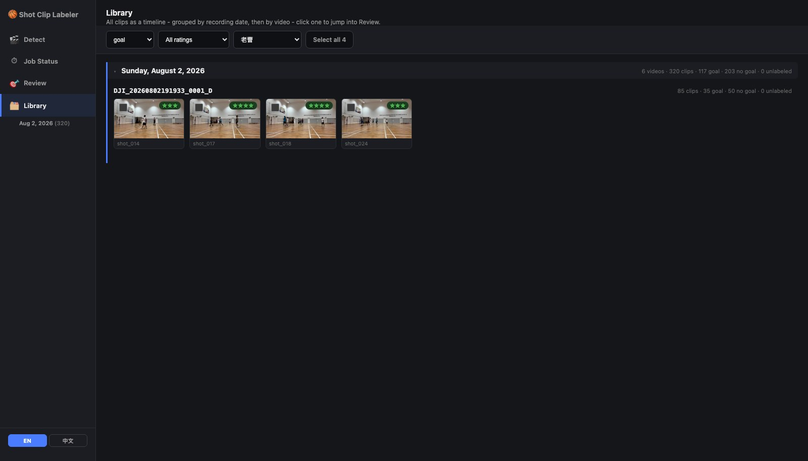
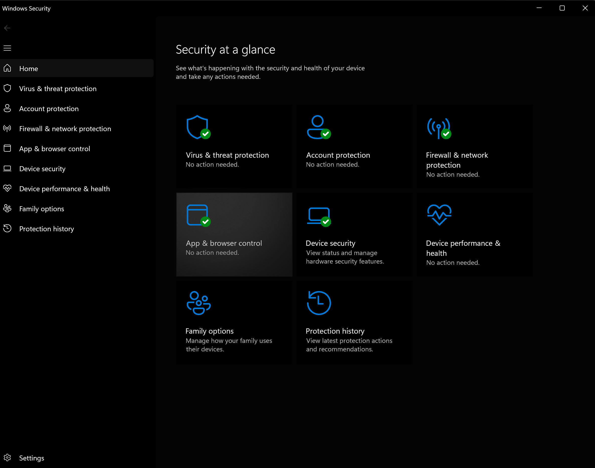
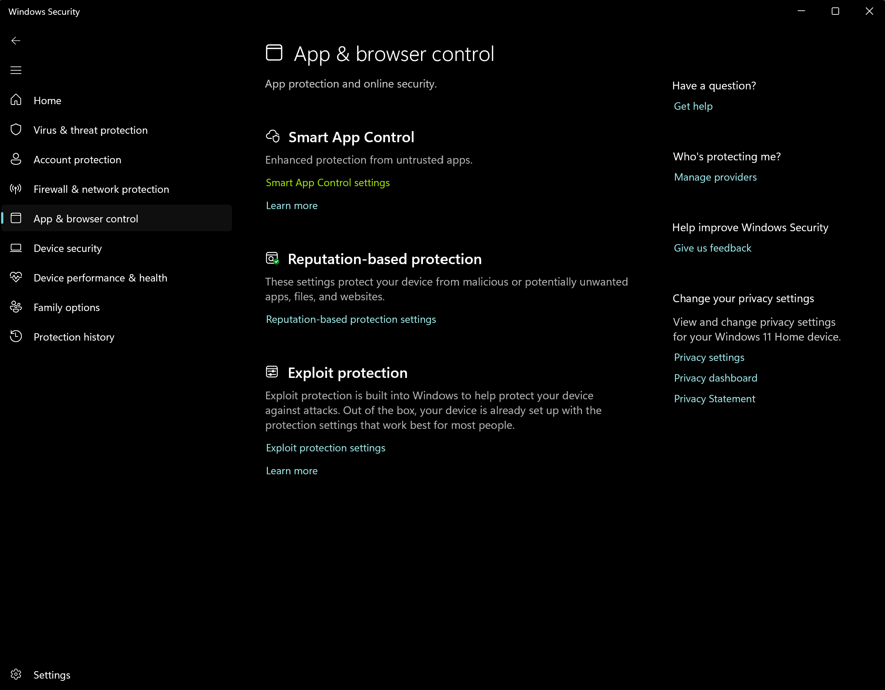
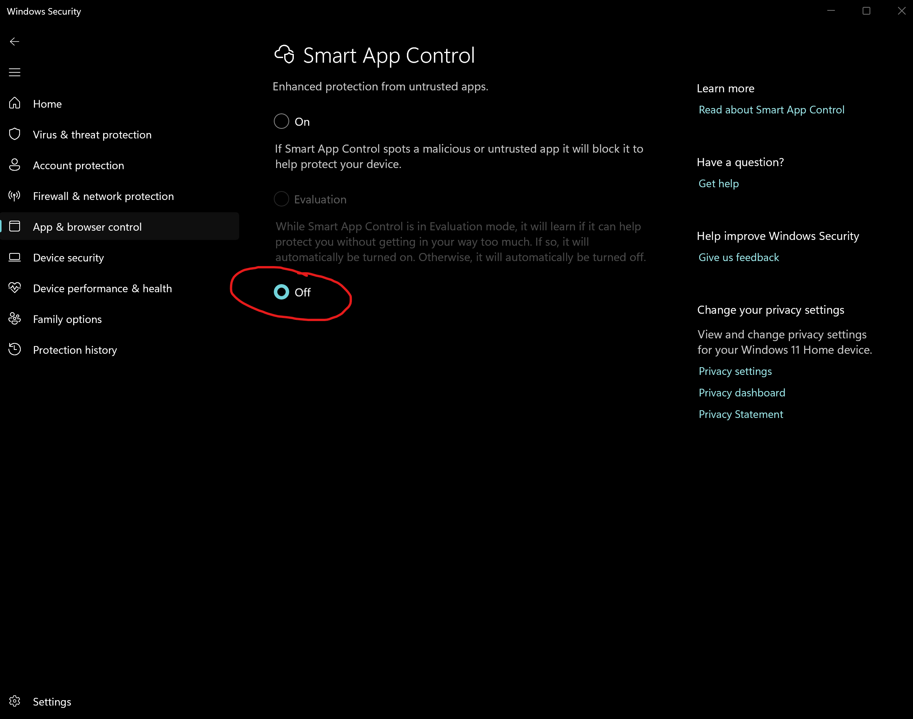

# shot-clipper

[中文](README.zh-CN.md)

Detects made basketball shots in fixed-camera video and cuts each one into
its own clip, plus a small local web UI for manually labeling those clips
goal / no-goal to build a training dataset.

Pipeline: calibrate the hoop region once per video -> run YOLO ball
detection + trajectory-through-hoop geometry to find candidate makes -> cut
each candidate into an independent clip with `ffmpeg` -> optionally review
clips in the label UI and export a goal/no-goal dataset.

See [docs/PLAN.md](docs/PLAN.md) for the full design rationale (in Chinese).

**Using Claude Code?** `.claude/skills/process-videos` automates the whole
"new videos in -> rated highlights out" flow described below - point it at a
folder of new videos and it drives detect/cut/filter for you, then hands off
to the label UI for review and helps you export the best-rated clips.

## Screenshots

**Detect** - turn raw video into candidate clips, with a speed/recall tradeoff:



**Job Status** - live progress while a job runs, plus history so you can rerun any past job with the same settings:



**Review** - rate each candidate clip against a 5-star guideline, and tag who scored (and who assisted) with a search-as-you-type player picker:



**Library** - every clip as a thumbnail timeline, grouped by recording date or by who scored, filterable by label/rating/scorer for a quick sanity-check or bulk export:



## Install

**Windows:** grab `shot-clipper-setup.exe` from the
[latest release](../../releases/latest) and run it. It installs
Python/Poetry/ffmpeg via `winget`, installs CUDA-accelerated torch on NVIDIA
machines, downloads the YOLO model weights, and adds a shortcut that opens
straight into the label UI, ready to detect and cut clips. See
[installer/README.md](installer/README.md) for details. Everything below is
the manual install path this wraps (also how macOS/Linux install).

### If Windows blocks the installer

The installer is unsigned, so Windows may refuse to run it. Two different
features do this and they need different answers - the wording on screen tells
you which one you have.

**SmartScreen** shows *"Windows protected your PC"* with a **More info** link.
Click **More info** > **Run anyway**. If your browser tagged the download,
right-click the `.exe` > *Properties* > tick **Unblock** first. Setup needs no
admin rights.

**Smart App Control** blocks the file outright, with no way to run it anyway.
It only ships enabled on clean installs of Windows 11 22H2 and later (it never
switches itself on after an upgrade), so most machines never hit this. To
install, turn it off:

1. Open **Windows Security** and choose **App & browser control**.

   

2. Under *Smart App Control*, click **Smart App Control settings**.

   

3. Select **Off**.

   

> **Turning Smart App Control off cannot be undone.** Windows only lets it be
> switched back on by resetting or reinstalling Windows - the toggle is one-way,
> and the *Evaluation* option greys out once you have chosen Off. If you would
> rather keep it, skip the installer entirely and follow the manual install
> below, which needs no signed binary.

Signing the installer is what would fix this properly for everyone; see
[installer/README.md](installer/README.md) for the options and what they cost.

Requires [Poetry](https://python-poetry.org/) and `ffmpeg` on `PATH`.

```bash
# label UI only (lightweight - just Flask)
poetry install

# detection/clipping pipeline (adds ultralytics/opencv/numpy)
poetry install --with ml

# + test tooling
poetry install --with ml,dev
```

All commands below assume you're running from the repo root, since default
paths (`data/`, `models/`, `clips/`) are resolved relative to the current
directory. Set `SHOT_CLIPPER_HOME` to anchor them somewhere else — see
[src/shot_clipper/paths.py](src/shot_clipper/paths.py) for the full list of
overrides, and [docs/PACKAGING.md](docs/PACKAGING.md) for why they exist.

## Detection pipeline

The labeling app's "process video" panel (see below) wraps steps 1-3 for
you. Use these directly for scripting/batch runs, or if you'd rather not
install the app at all.

```bash
# 1. one-time hoop calibration per video -> data/configs/<name>.json
poetry run shot-clipper-calibrate path/to/video.MP4

# 2. detect candidate makes -> data/ground_truth/<name>_detected.json
poetry run shot-clipper-detect path/to/video.MP4

# 3. cut each candidate into its own clip -> clips/<name>/shot_NNN.mp4
poetry run shot-clipper-clip path/to/video.MP4 data/ground_truth/<name>_detected.json

# optional: compare detected timestamps against a hand-recorded list
poetry run shot-clipper-validate detected.json ground_truth.json
```

Model weights (`yolov8m.pt`) are expected at `models/yolov8m.pt`; download
from Ultralytics if not present. `scripts/run_batch.sh` runs steps 2-3 over
a batch of source videos. `shot-clipper-train-filter` (see below) separately
expects `models/yolov8l.pt`.

## Using the labeling app

A local web app for going through candidate clips and marking each one
`goal` or `no_goal`, building `data/dataset/labels.json` as you go. This is
the main day-to-day way to use the project - most people won't need the raw
CLI commands above at all.

### 1. Start it

```bash
poetry install --with ml     # needed for the Detect tab; skip if you only label existing clips
poetry run shot-clipper-label-ui --clips-dir /path/to/clips
# open http://127.0.0.1:5050
```

`--clips-dir` points at the folder that holds one subfolder of clips per
source video (e.g. `<clips-dir>/DJI_0010/shot_001.mp4`, ...). Omit it to use
`$SHOT_CLIPPER_CLIPS_DIR` or the built-in default.

Or run it in Docker:

```bash
CLIPS_DIR=/path/to/clips docker compose up --build
```

This starts **two** containers: `label-ui` (the web app you open in a
browser) and `worker` (runs detection jobs). They're split up so that
rebuilding/restarting the UI while a detection job is running can't kill
it - `worker` is a separate container with its own process tree, not just
a background thread inside `label-ui`. `label-ui` just queues jobs onto a
shared `data/jobs/` volume; `worker` picks them up. Both containers include
the `ml` extras (torch/ultralytics/opencv), so detection genuinely runs here.

On an NVIDIA host, add the GPU overlay for CUDA inference and NVDEC decode:

```bash
CLIPS_DIR=/path/to/clips docker compose \
    -f docker-compose.yml -f docker-compose.nvidia.yml up --build
```

**On macOS, Docker is CPU-only** and now noticeably so: there's no GPU
passthrough, so no MPS, and the container's Linux ffmpeg has no VideoToolbox
either - meaning Docker loses *both* accelerators while running natively gets
both. Run long videos natively on a Mac. See [docs/GPU_SETUP.md](docs/GPU_SETUP.md).

The app has four sections in the sidebar: **Detect** (turn raw video into
candidate clips), **Job Status** (progress of whatever's running),
**Review** (label clips - see below), and **Library** (every clip as a
timeline, grouped by recording date then by video, or by who scored - click
one to jump into Review). The Review nav item carries a badge with how many clips still need
attention; Job Status gets a small colored dot (blue = running, green =
done, red = error) whenever a job is active, so you can tell at a glance
without switching over to it. A language switch (EN / 中文) sits at the
bottom of the sidebar and covers the whole UI, not just labels - it's
remembered per browser.

### 2. (Optional) Turn raw video into candidate clips

If you already have clips in `--clips-dir`, skip to step 3 - the app loads
them automatically. To generate clips from new source video instead,
without touching the CLI, go to the **Detect** tab. The "clips folder"
field is pre-filled with whatever `--clips-dir` this was started with -
change it (e.g. to start a fresh project in an empty folder, or **Browse…**
to pick one from a native folder dialog) and the app switches to
browsing/labeling that folder too, so new clips always land somewhere you
can immediately see and label them.

The tab has two modes:
- **Single video**: give the full path to one video file (type it, paste
  it, or click **Browse…** for a native file picker) and click **"Detect &
  cut clips"**.
- **Batch folder**: give the path to a folder of new videos and click
  **"Process all videos"**. Every video with an existing hoop calibration
  is queued and processed **sequentially** (running several YOLO detections
  at once would just contend with itself on a personal machine) - videos
  without one yet are reported back as skipped, not queued.

Either way, submitting switches you straight to the **Job Status** tab,
which shows the live message and progress bar - and for a batch, a table of
each video's makes/kept/dropped counts as they finish, plus which videos
were skipped for missing calibration. **You don't have to wait for the
whole batch**: each video's clips land on disk and show up in Review the
moment *that* video finishes, so you can switch over and start reviewing it
immediately while the rest of the queue keeps processing in the background.

Processing a video requires a one-time hoop calibration first. For a single
video, click **🎯 Calibrate hoop** right there in Detect - it pulls a still
frame from the video (via `ffmpeg`, so this works in Docker too) and lets
you drag a box around the hoop directly in the browser, no separate step.
The older CLI equivalent (`poetry run shot-clipper-calibrate
path/to/video.MP4`, an OpenCV window) still works if you prefer it, but has
to run **natively on your Mac** (`poetry install --with ml` first) since it
needs a real display, which Docker doesn't have. Either way the result is
the same small tracked file, `data/configs/<video>.json`, so a calibration
saved from the in-browser tool while running in Docker is immediately
visible to a natively-run instance too, and vice versa. For a batch,
uncalibrated videos are just skipped and named in the response - calibrate
them individually from the single-video tab, then re-run the batch.

**Detection speed**: the default samples the video at 15fps and is the
only setting that's actually been validated for recall (see "Improving
precision" below). With GPU acceleration on (see
[docs/GPU_SETUP.md](docs/GPU_SETUP.md)) that's **~6x realtime on Windows/Linux
+ NVIDIA** (RTX 4070, CUDA + NVDEC decode) or **~0.8x realtime on Apple
Silicon** (M3 Max, MPS + VideoToolbox decode) - so a 10-minute video is
roughly 100 seconds or 12 minutes to process, respectively. CPU-only
(e.g. Docker on a Mac, which gets neither accelerator) is well below
realtime and can take well over the video's own runtime. The
"Detection speed" card in Detect lets you pick 8fps or 5fps sampling
instead, trading some recall (a make that only shows the ball in the hoop
for a couple of frames can get sampled right past) for real speed. Job
Status shows a live %, elapsed time, and ETA once detection starts, and a
**Stop** button to cancel a job partway through - safe to use, it either
kills the job outright (queued) or asks it to stop cleanly at the next
frame batch (running), never leaving a half-written clip mid-write.

**Native path pickers**: since this is a local app, **Browse…** buttons
trigger a real macOS file/folder dialog (via `osascript`) instead of making
you type or paste a path - also sidesteps a real gotcha, where pasting a
path copied from a browser address bar or dragged from Finder can come
through as a `file://` URL with `%20`s instead of spaces; the app now
accepts that transparently either way. Wherever `osascript` can't run at
all (Docker has no macOS to call out to), **Browse…** falls back to an
in-app folder browser instead of just failing.

That in-app browser starts at, and stays confined to, a single "media
root" folder - `/Users/pengtan/Videos` by default - so you're never
browsing through unrelated system folders (Docker's `/root`, `/etc`, ...)
to find your own videos. **Set `SHOT_CLIPPER_MEDIA_ROOT` to point it at
wherever your videos actually live** (both new source video and clip
output normally live somewhere under this one folder, in their own
subfolders):

```bash
SHOT_CLIPPER_MEDIA_ROOT=/path/to/your/videos poetry run shot-clipper-label-ui --clips-dir /path/to/clips
# or, in Docker, add it alongside CLIPS_DIR:
SHOT_CLIPPER_MEDIA_ROOT=/path/to/your/videos CLIPS_DIR=/path/to/clips docker compose up --build
```

If you're using Docker, also update the video-folder volume mount in
`docker-compose.yml` (`VIDEO_DIR`, mounted read-only) to match the same
path, or the browser will have nothing to show.

### 3. Label clips - and rate your goals

The video for the current clip autoplays and loops. Go through them with:

| Key | Action |
|---|---|
| `G` | mark **goal** (stays on the clip so you can rate it) |
| `N` or `X` | mark **no goal** (auto-advances) |
| `1`-`5` | rate this clip N stars - marks it goal too if it wasn't already, then advances |
| `0` | clear the star rating (keeps the goal label) |
| `Backspace` | clear the label entirely (and any rating) |
| `←` / `→` | previous / next clip |
| `M` | toggle mute |
| `R` | replay from the start |
| `[` / `]` | slow down / speed up playback (0.25x-3x) |

Stars (1-5) capture how good/highlight-worthy a make is - rate the ones
you'd actually want in a video edit higher. A clip only counts as "done" once
it's `no_goal`, or `goal` *and* rated - so `no_goal` still auto-advances
immediately, but marking `goal` pauses on the clip until you press a number
key. The header's segmented progress bar shows the mix of goal / needs-rating
/ no-goal at a glance, with exact counts in the pills above it. The gear icon
(⚙) opens **jump to next incomplete** (on by default - skips straight to
whatever still needs a label or rating), **sort by confidence** (see below),
and playback speed. Every action saves immediately to
`data/dataset/labels.json` - safe to close the tab and resume later.

If clips were cut with `--filter-model` (see below), each one carries the
trained filter's confidence score - shown next to the label badge, and
sortable via the **"sort by confidence"** checkbox so you review the
most-likely-real goals first instead of wading through false positives in
file order. It's a triage aid, not an auto-filter - the geometric detector
still over-generates candidates by design, so you're always the one making
the final goal/no_goal call.

**Scorer** and **Assist** pickers next to the video (goal clips only) tag
who made the shot and who set it up - type a name and matching players
from the roster show up as clickable pills below the search box; a typed
name that isn't in the roster yet shows up as its own "+" pill to add and
tag in one click. This is tagged by hand today; there's no automated
jersey/face recognition yet (see
[docs/PLAYER_IDENTIFICATION.md](docs/PLAYER_IDENTIFICATION.md) for why, and
the staged plan if that changes). Tagging enough clips is what would make
that plan possible in the first place - each tag is a hand-labeled
example an automated suggester could eventually be checked against.

### 4. Export the dataset (or just your best highlights)

Once you've labeled some clips, materialize them into a flat `goal/`/
`no_goal/` folder layout (symlinks by default, so it's instant and doesn't
duplicate video files). Goal clips get their rating in the filename, e.g.
`DJI_0001_D__shot_012_5star.mp4`:

```bash
poetry run shot-clipper-build-dataset --clips-dir /path/to/clips
# -> data/dataset/goal/, data/dataset/no_goal/

# only your best-rated goals (e.g. for pulling into a video edit) - no_goal is still exported in full
poetry run shot-clipper-build-dataset --clips-dir /path/to/clips --min-stars 4

# group into goal/5star/, goal/4star/, ... instead of one flat folder
poetry run shot-clipper-build-dataset --clips-dir /path/to/clips --group-by-stars

# just one player's makes (tagged via the Scorer picker) - a per-player highlight reel
poetry run shot-clipper-build-dataset --clips-dir /path/to/clips --player Alice --min-stars 4
```

Video editors like CapCut have no concept of custom clip metadata/ratings,
so the filename suffix and `--group-by-stars` folders are how a rating
actually carries over on import - CapCut (and most editors) turns an
imported folder's subfolders into separate bins in the media panel, so you
can see and pick your 5-star clips without re-reviewing every one. Combine
with `--min-stars` to skip exporting anything below a bar you don't care
about at all.

The same trick works per player, straight from the **Library** tab, with no
CLI at all. Switch its first dropdown to **Group by scorer** and the
timeline regroups into one section per player - ordered by who scored most,
with "No scorer tagged" and "Not a goal" always last - so you can see each
player's makes together, narrow further with the rating filter, and hit
**Select all** on exactly the set you want. Then in **Export selected…**,
tick **One subfolder per scorer**: every clip lands in `<dest>/<player>/`
(anything untagged goes to `_no_scorer/`) instead of one flat folder, which
is the layout that becomes one bin per player on import. The scorer name is
dropped from the filenames in that mode - the folder already says whose
clip it is - but the `_Nstar` suffix stays, so ratings still survive.
Exports are symlinks by default; on a system that won't create them
(Windows without Developer Mode or admin rights) the app falls back to real
copies and tells you it did, rather than failing the export.

### 5. Sanity-check before importing

`shot-clipper-contact-sheet` generates a single static HTML page - a
thumbnail grid grouped by folder - so you can eyeball an export before
dropping it into your editor, without opening the label UI or scrubbing
through Finder one file at a time:

```bash
poetry run shot-clipper-contact-sheet data/dataset/goal --recursive --cols 6
# -> data/dataset/goal/contact_sheet.html (thumbnails in a sibling folder)
```

`--recursive` picks up `--group-by-stars` subfolders and gives each one its
own section (5star, 4star, ... first, everything else after). Thumbnails
are grabbed at 5 seconds into each clip by default (`--at`), matching where
the shot/make moment lands in a default `[t-5s, t+2s]` cut.

## Improving precision with a trained filter

`find_makes()` (the geometry rule that decides which ball trajectories look
like a make) is deliberately recall-first (docs/PLAN.md decision 5) - it
over-generates candidates rather than risk missing a real make, which means
a lot of what it flags isn't actually a goal. Once you've labeled enough
clips, train a small classifier to filter those false positives back out:

```bash
poetry install --with ml
poetry run shot-clipper-train-filter --clips-dir /path/to/clips
```

This extracts two complementary feature sets for every labeled clip -
trajectory features (descent speed, dwell time in the hoop box, bounce-back
signal, etc. - `src/shot_clipper/features.py`) and net-motion features
(pixel motion in the net region right after the candidate event - shape of
the motion burst, optical-flow directional coherence - `src/shot_clipper/net_motion.py`,
needs no ball detection) - evaluates the combination with leave-one-video-out
cross-validation, and picks a confidence threshold that keeps recall >= 98%
(`--min-recall` to change) while maximizing precision. It prints a
before/after precision report per video and saves the model to
`models/shot_filter.joblib`.

**Results on the 307-clip labeled dataset** (9 videos): baseline candidate
precision is 34.2%. Two things mattered to get a real improvement out of
this:
- Ball detection quality: the default `yolov8m` detector is too sparse for
  feature extraction - 19% of real goals had no usable above-hoop ->
  through-hoop trajectory at all, capping what any filter could safely do.
  `shot-clipper-train-filter` defaults to the larger `models/yolov8l.pt` for
  feature extraction specifically (100% of real goals get a usable
  trajectory with it, vs. 81%; not validated as the primary detector for
  `shot-clipper-detect` itself).
- Net motion alone carries almost no signal (34.3%, basically baseline) but
  is clearly complementary to trajectory features - combined, they roughly
  double how many false positives the filter can safely drop at the same
  recall target, versus trajectory features alone.

At the default 98%-recall threshold, the deployed model gets **34.2% ->
41.7% precision**, dropping 60 of 307 candidates and risking 2 of 105 real
goals. If you're willing to trade more recall for precision, the achievable
ceiling is much higher - rerun with `--min-recall <x>` to pick a different
point on that curve; the report table shows exactly how many candidates
would be dropped and how many real goals would be at risk at each setting.

Once trained, it's used automatically:
- `shot-clipper-clip --filter-model models/shot_filter.joblib` scores each
  clip right after cutting it (net-motion features need actual pixels, so
  filtering happens after clipping, not during detection) and deletes the
  ones below the threshold; dropped clips are logged to stdout with their
  score.
- The label UI's "process video" panel applies it automatically whenever
  `models/shot_filter.joblib` exists (pass `"use_filter": false` in the
  `/api/process-video` request body to opt out for one run).

## Tests

```bash
poetry install --with ml,dev
poetry run pytest
```

## Project layout

```
src/shot_clipper/      installable package (CLI tools + label_ui Flask app)
data/configs/          per-video hoop calibration (tracked)
data/ground_truth/      detector output / human-recorded make timestamps (tracked)
data/dataset/          labels.json + materialized goal/no_goal folders
models/                 YOLO weights (not tracked - see Install)
clips/                  generated shot clips (not tracked)
scripts/                batch-processing helper scripts
docs/                   design notes
tests/                  unit tests
.claude/skills/         Claude Code skills (tracked - see process-videos above)
```
